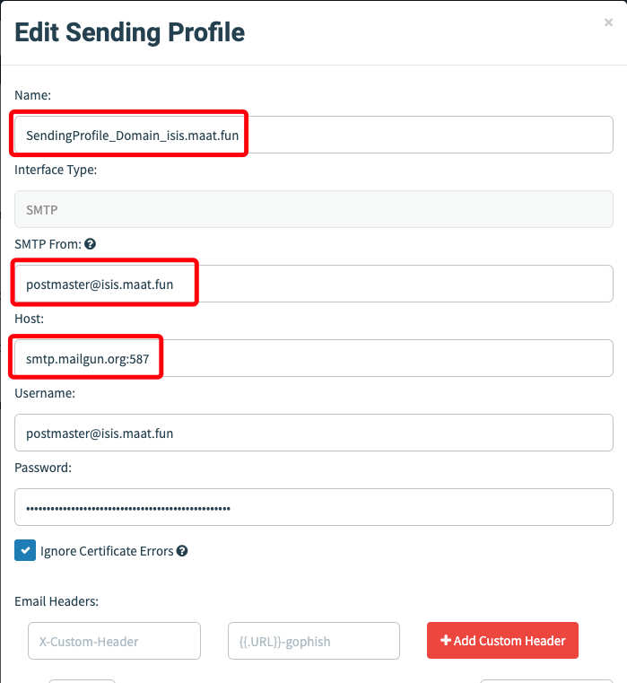

# Configurando vários domínios no ambiente do GoPhish

Um pouco tempo um aluno do curso de Campanhas de Phishing com GoPhish me perguntou sobre a possibilidade de inserir vários domínios para uma mesma instância do GoPhish, ou melhor, para uma mesma instalação do GoPhish. Fiz algumas pesquisas e estou disponibilizando aqui um tutorial de como fazer essa configuração.

## Instalação do Caddy 

O Caddy é um webserver e também um proxy reverso para aplicações web. Aqui vamos utilizar o Caddy justamente como proxy reverso para que os vários domínios que vamos utilizar no phishing sejam direcionados para a instância do GoPhish.

Ou seja, para que sejam direcionados para o ```phish_server``` que configuramos no arquivo ```config.json``` do GoPhish.

### Instalação do Caddy (em um servidor GNU/Linux Ubuntu)

```
apt install -y debian-keyring debian-archive-keyring apt-transport-https curl
curl -1sLf 'https://dl.cloudsmith.io/public/caddy/stable/gpg.key' | gpg --dearmor -o /usr/share/keyrings/caddy-stable-archive-keyring.gpg
curl -1sLf 'https://dl.cloudsmith.io/public/caddy/stable/debian.deb.txt' | tee /etc/apt/sources.list.d/caddy-stable.list
apt update
apt install caddy -y
```

#### [ Caddy - Guia de instalação ](https://caddyserver.com/docs/install#static-binaries)

#### Comandos básicos do Caddy:

```
caddy start|stop|reload
```

#### [ Caddy - Comandos ](https://caddyserver.com/docs/command-line)

O Caddy funciona basicamente configurando um arquivo, o ```Caddyfile```.

Para esse exemplo, o meu arquivo Caddyfile ficou assim:

```
maat.fun {
   reverse_proxy 127.0.0.1:8181
}

isis.maat.fun {
    reverse_proxy 127.0.0.1:8181
}
```

Ou seja, as requisições para os domínios ```https://maat.fun``` na porta 443 e para o domínio ```https://isis.maat.fun``` na porta 443 vão ser direcionadas para para o localhost (127.0.0.1) na porta 8181.

Nosso arquivo de configuração do GoPhish, o arquivo ```config.json``` ficou assim:

```
{
    "admin_server": {
            "listen_url": "0.0.0.0:8080",
            "use_tls": true,
            "cert_path": "/etc/letsencrypt/live/maat.fun/fullchain.pem",
            "key_path": "/etc/letsencrypt/live/maat.fun/privkey.pem"
    },
    "phish_server": {
            "listen_url": "127.0.0.1:8181",
            "use_tls": false,
            "cert_path": "example.crt",
            "key_path": "example.key"
    },
    "db_name": "sqlite3",
    "db_path": "gophish.db",
    "migrations_prefix": "db/db_",
    "contact_address": "abuse@domain.com.br",
    "logging": {
            "filename": "",
            "level": ""
    }
}
```

#### Atenção:

Temos o nosso GoPhish da interface de administração ("admin_server"), que está na porta 8080 e seu IP está configurado como 0.0.0.0, isto quer dizer que ele pode receber conexões da internet, que é justamente o que queremos afim de fazer as configurações, criar campanhas, configurar e-mail etc.

O nosso GoPhish na interface de servidor de phishing ("phish_server") está configurado apenas para receber conexões locais (127.0.0.1), isso quer dizer que pela internet não é possível fazer o acesso nas páginas de phishing, quem vai fazer esse papel será jusmante o Caddy que configuramos.

Então quando alguém fizer o acesso em nossas páginas de phishing, tanto ```https://maat.fun``` como ```https://isis.maat.fun``` ou qualquer outra, esse acesso será internamente direcionado para a interface "phish_server" do GoPhish. Isso poderá ser feito em qualquer domínio, não apenas para subdomínios como estou usando de exemplo.

Poderia ser por exemplo os sites: ```https://admin.meusite.com.br/``` , ```https://vpn.empresax.net``` e ```https://manager.org-abc.com```. O que importa aqui é simplesmente que os domínios estajam configurados com suas respectivas entradas do tipo A no seu DNS para o IP do servidor que está hospedado tanto o Gophish como o Caddy.

<hr>

# Configurações 

O primeiro passo é gerar os certificados Let`s Encrypt para os outros domínios que você deseja utilizar. Essa parte foi explicada no curso que está na Udemy e aqui neste repositório tem um script em ShellScript para ajudar nesta tarefa.

**Preciso passar o caminho(path) do certificado para o Caddy? Não, ele automaticamente localiza esses certificados.**

O segundo passo é configurar o e-mail para o domínio caso você queria fazer uso deles, essa parte também foi explicada no curso.

Eu fiz a configuração dos dois domínios.


Ou seja, fiz todas aquelas configurações de TXT, MX, SPF e CNAME que o MailGun solicita.

Depois será preciso configurar esses e-mails no GoPhish na área de "Sending Profile".




**Lembrando novamente, embora sejam apenas subdomínios diferentes de um mesmo domínio, tecnicamente é como se fossem domínios diferentes.**

Faça o teste e verifique se está recebendo corretamente os e-mails dos novos domínios que foram configurados.


Com o Sending Profile configurado, E-mail template criado e a Lading Page configurada, mas agora inserir a URL do domínio que você quer utilizar.

No meu teste, configurei duas campanhas, uma para o domínio ```htps://maat.fun``` e outra para o domínio ```https://isis.maat.fun/```.


E para cada campanha, utilizei o Sending Profile correspondente ao domínio.

Após feita todas as configurações, basta fazer o disparo das campanhas.

Claro, não esquecer de iniciar o Caddy para que ele faça o controle das páginas e direciona os acessos da página de phishing para o GoPhish.

O arquivo de configuração padrão do Caddy, o arquivo ```Caddyile``` fica em ```/etc/caddy/```. Mas podemos criar o nosso arquivo e fazer sua chamada.


No exemplo, o arquivo ```Caddyfile``` está em ```/opt/caddy-estudos/``` e estou fazendo sua chamado diretamente neste local.

Comando:
```
caddy run Caddyfile
```


Ou, você pode usar o comando abaixo para deixar o Caddy rodando em background e liberar o terminal.

```
caddy start --config Caddyfile
```


Abaixo podemos verificar os dois domínios funcionando corretamete.


